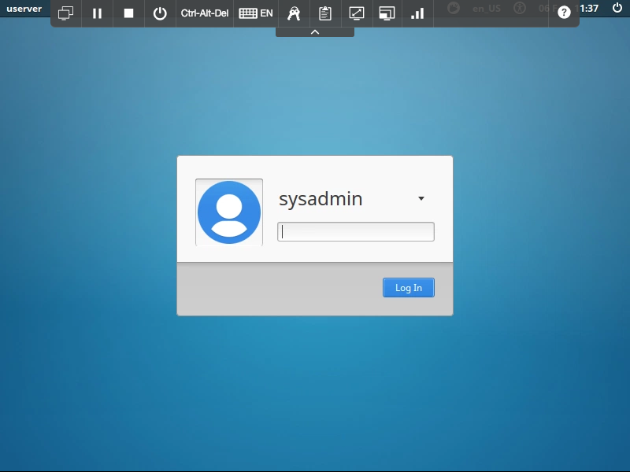

# Starting Up the Lab Environment

## Use these steps to power up your IBM Cloud Private cluster and prepare for the lab

Login to SkyTap.  Start the cluster by using the **Start** button in the upper left hand corner to start all the nodes


Once all systems show **Running** status (this may take a few minutes), open the **client** system from within the SkyTap interface


> You can adjust the screen resolution of the SkyTap environment using the  and  buttons in the menu bar.

At the prompt, login using **sysadmin** with password of **passw0rd**



After you have logged in to the system:

- Open the **Firefox Web Browser** (link on the desktop) 
- Enter the URL https://10.10.1.10:8443 in the address bar to access the ICP dashboard
- Login with the credentials userid/password = **admin/passw0rd**


Next open another Browser tab and navigate to **ibm.biz\thinkcal**

> By opening the above link you will easily be able to copy commands from the lab into your SkyTap environment.  Copying and pasting using the SkyTap environment can become tedious.

Next open the **Terminal** application (link on the desktop)

Initialize the ICP CLI userid/password = **admin/passw0rd**

```
cloudctl login -a https://10.10.1.10:8443 --skip-ssl-validation
```

Select the **cloudcluster** account and the **default** namespace when prompted.


# Securing an ICP Cluster with Policy

During this lab, you will explore how network policy can be used to secure workload in your IBM Cloud Private cluster.  

> If you manage an ICP cluster, you will likely want to provide additional security beyond the default behavior.  By design, Kubernetes has a principal that all pods within your cluster can communicate with all other pods within your cluster.  If you have time, after completing the lab you can explore the basic Linux networking settings configured on your hosts.  There will be some hints for this activity following the final section.

In the Basic Policy Example you will be guided through the following procedures:

* Setting your first basic network policy
* Configuring a frontend / backend policy example
* Controlling ingress and egress traffic using policy
* Applying application layer policy

## Basic Policy Example

### Configure Namespaces

This lab will deploy pods in a Kubernetes namespace **policy-demo**. Let’s create the Namespace object
```
kubectl create ns policy-demo
```

### Create Demo Pods

Use Kubernetes **Deployment** objects to easily create pods in the namespace.  Create some nginx pods in the policy-demo namespace.

```
kubectl run --namespace=policy-demo nginx --replicas=2 --image=nginx
```

Expose them through a service.

```
kubectl expose --namespace=policy-demo deployment nginx --port=80
```

Ensure the nginx service is accessible.

> Throughout these labs you will use this busybox pod **below** to probe your environment and determine the state of workload connectivity.  You will find it convenient to open a separate terminal window and leave this prompt running.

```
kubectl run --namespace=policy-demo access --rm -ti --image busybox /bin/sh
```

This should open up a shell session inside the access pod, as shown below.

```
Waiting for pod policy-demo/access-472357175-y0m47 to be running, status is Pending, pod ready: false

If you don't see a command prompt, try pressing enter.
/ #
```

From inside the access pod, attempt to reach the nginx service.

```
wget -q nginx -O -
```

You should see a response from nginx. Great! Our service is accessible. You can now exit the pod.

### Enable isolation

Let’s turn on isolation in our policy-demo namespace. Calico will then prevent connections to pods in this namespace.  

> This is one of the fundamental building blocks that you can use to secure workload within your clusters.  You will typically create isolated spaces within the cluster and purposefully return only desired connectivity.

Running the following command creates a NetworkPolicy which implements a default deny behavior for all pods in the policy-demo namespace.

```
kubectl create -f - <<EOF
kind: NetworkPolicy
apiVersion: networking.k8s.io/v1
metadata:
  name: default-deny
  namespace: policy-demo
spec:
  podSelector:
    matchLabels: {}
EOF
```

> Within our ICP cluster, Calico and Kubernetes have teamed up to create policy for controlling network behavior.  When initiating this policy from Kubernetes it is called **NetworkPolicy**.  You can also create this policy using the **calicoctl** interface.  In this case the syntax is different, and the policy is simply referred to as **policy**.  How does this network policy actually control connectivity within the cluster?  Simple, each Linux node within this cluster has **IPTables** configured.  This acts as a firewall each of your nodes.  If you are familiar with container and Kubernetes networks, you will know that each Pod simply gets an interface configured on the node it is hosted on.  Associated routes are configured (conveniently by Kubernetes and Calico) so that workloads can find each other (and your Ingress traffic can find its destination).  Of course **services** help all of this happen quite conveniently.  IPTables (or IPVS if you have configured that method when you deployed your cluster) provides some boundaries.

### Test Isolation

This will prevent all access to the nginx service. We can see the effect by trying to access the service again (or switch to the window where you have busybox already running).

```
kubectl run --namespace=policy-demo access --rm -ti --image busybox /bin/sh
```

This should open up a shell session inside the access pod, as shown below.

```
Waiting for pod policy-demo/access-472357175-y0m47 to be running, status is Pending, pod ready: false

If you don't see a command prompt, try pressing enter.

/ #
```

Now from within the busybox access pod execute the following command to test access to the nginx service.

```
wget -q --timeout=5 nginx -O -
```

The request should time out after 5 seconds.

```
wget: download timed out
/ #
```

By enabling isolation on the namespace, we’ve prevented access to the service.

> If you are familiar with IPTables you could inspect the configuration and find a Chain that denies this connectivity.

### Allow Access using a NetworkPolicy

Now, let’s enable access to the nginx service using a NetworkPolicy. This will allow incoming connections from our access pod, but not from anywhere else.

> This is a typical secure method of establishing only the connections you desire within the cluster.  This is how we build our secure point-to-point mesh.

Create a network policy access-nginx with the following contents:

```
kubectl create -f - <<EOF
kind: NetworkPolicy
apiVersion: networking.k8s.io/v1
metadata:
  name: access-nginx
  namespace: policy-demo
spec:
  podSelector:
    matchLabels:
      run: nginx
  ingress:
    - from:
      - podSelector:
          matchLabels:
            run: access
EOF
```

> The NetworkPolicy allows traffic from Pods with the label **run: access** to Pods with the label **run: nginx**. These are the labels automatically added to Pods started via kubectl run based on the name of the Deployment.

We should now be able to access the service from the access pod.

```
kubectl run --namespace=policy-demo access --rm -ti --image busybox /bin/sh
```

This should open up a shell session inside the access pod, as shown below.

```
Waiting for pod policy-demo/access-472357175-y0m47 to be running, status is Pending, pod ready: false

If you don't see a command prompt, try pressing enter.
/ #
```

Now from within the busybox access pod execute the following command to test access to the nginx service.

```
wget -q --timeout=5 nginx -O -
```

However, we still cannot access the service from a pod without the label **run: access**. We can verify this as follows.

```
kubectl run --namespace=policy-demo cant-access --rm -ti --image busybox /bin/sh
```

This should open up a shell session inside the **cant-access** pod, as shown below.

```
Waiting for pod policy-demo/cant-access-472357175-y0m47 to be running, status is Pending, pod ready: false

If you don't see a command prompt, try pressing enter.
/ #
```

Now from within the busybox cant-access pod execute the following command to test access to the nginx service.

```
wget -q --timeout=5 nginx -O -
```

The request should time out.

```
wget: download timed out
/ #
```

You can clean up the demo by deleting the demo namespace.

```
kubectl delete ns policy-demo
```

This was just a simple example of the Kubernetes NetworkPolicy API and how Calico can secure your Kubernetes cluster.

## Running the Stars Example

This demo will give you a much more visual way of creating a zoned environment within your cluster.  After completing this section you will likely have a better idea of how you could recreate a typical tiered application network.  Creating traditional zoned environments might seem desirable, but try to think of your cluster network as point to point, only allowing the connections defined between only the workloads you wish to communicate.  

Create the frontend, backend, client, and management-ui apps.

```
kubectl create -f https://docs.projectcalico.org/v3.5/getting-started/kubernetes/tutorials/stars-policy/manifests/00-namespace.yaml
kubectl create -f https://docs.projectcalico.org/v3.5/getting-started/kubernetes/tutorials/stars-policy/manifests/01-management-ui.yaml
kubectl create -f https://docs.projectcalico.org/v3.5/getting-started/kubernetes/tutorials/stars-policy/manifests/02-backend.yaml
kubectl create -f https://docs.projectcalico.org/v3.5/getting-started/kubernetes/tutorials/stars-policy/manifests/03-frontend.yaml
kubectl create -f https://docs.projectcalico.org/v3.5/getting-started/kubernetes/tutorials/stars-policy/manifests/04-client.yaml
```

Wait for all the pods to enter Running state.

```
kubectl get pods --all-namespaces --watch
```

Note that it may take several minutes to download the necessary Docker images for this demo.

The management UI runs as a NodePort Service on Kubernetes, and shows the connectivity of the Services in this example.

You can view the UI by visiting `http://10.10.1.10:30002` in your browser.

Once all the pods are started, they should have full connectivity. You can see this by visiting the UI. Each service is represented by a single node in the graph.

* backend -> Node “B”
* frontend -> Node “F”
* client -> Node “C”

### Enable Isolation

Running following commands will prevent all access to the frontend, backend, and client Services.

```
kubectl create -n stars -f https://docs.projectcalico.org/v3.5/getting-started/kubernetes/tutorials/stars-policy/policies/default-deny.yaml
kubectl create -n client -f https://docs.projectcalico.org/v3.5/getting-started/kubernetes/tutorials/stars-policy/policies/default-deny.yaml
```

> Copy the URLs into your browser to follow the logic within the policy defenitions.  NetworkPolicy can be a little odd to read, consider less to be more in this syntax.

### Confirm Isolation

Refresh the management UI (it may take up to 10 seconds for changes to be reflected in the UI). Now that we’ve enabled isolation, the UI can no longer access the pods, and so they will no longer show up in the UI.

Next, allow the UI to access the Services using NetworkPolicy objects

Apply the following YAMLs to allow access from the management UI.

```
kubectl create -f https://docs.projectcalico.org/v3.5/getting-started/kubernetes/tutorials/stars-policy/policies/allow-ui.yaml
kubectl create -f https://docs.projectcalico.org/v3.5/getting-started/kubernetes/tutorials/stars-policy/policies/allow-ui-client.yaml
```

> Once again copy the URLs into your browser to follow the logic within the policy definitions. 

After a few seconds, refresh the UI - it should now show the Services, but they should not be able to access each other any more.

Create the backend-policy.yaml file to allow traffic from the frontend to the backend.

```
kubectl create -f https://docs.projectcalico.org/v3.5/getting-started/kubernetes/tutorials/stars-policy/policies/backend-policy.yaml
```
> View the policy defenition from within your browser. 

Refresh the UI. You should see the following:

* The frontend can now access the backend (on TCP port 6379 only).
* The backend cannot access the frontend at all.
* The client cannot access the frontend, nor can it access the backend.

Expose the frontend service to the client namespace.

```
kubectl create -f https://docs.projectcalico.org/v3.5/getting-started/kubernetes/tutorials/stars-policy/policies/frontend-policy.yaml
```

> View the policy definition from within your browser. 

The client can now access the frontend, but not the backend. Neither the frontend nor the backend can initiate connections to the client. The frontend can still access the backend.

## Controlling Ingress and Egress Traffic with Network Policy

The Kubernetes NetworkPolicy API allows users to express ingress and egress policies.  This portion of the lab walks through using Kubernetes NetworkPolicy to define more complex network policies.

> Controlling Egress is enhanced by using the **calicoctl** interface (not included in this lab).  To get the most fined grained control over traffic ingress-ing and egressing (especially) your cluster, Istio service mesh provides a fantastic solution.

Tutorial Flow:

* Create the Namespace and Nginx Service
* Deny all ingress traffic
* Allow ingress traffic to Nginx
* Deny all egress traffic
* Allow egress traffic to kube-dns

### Create the Namespace and Nginx Service

We’ll use a new namespace for this guide. Run the following commands to create it and a plain nginx service listening on port 80.

```
kubectl create ns advanced-policy-demo
kubectl run --namespace=advanced-policy-demo nginx --replicas=2 --image=nginx
kubectl expose --namespace=advanced-policy-demo deployment nginx --port=80
```

#### Verify Access - Allowed All Ingress and Egress

If you do not still have your busybox shell available, open up a second shell session which has kubectl connectivity to the Kubernetes cluster and create a busybox pod to test policy access. This pod will be used throughout this tutorial to test policy access.

```
kubectl run --namespace=advanced-policy-demo access --rm -ti --image busybox /bin/sh
```

This will open up a shell session inside the access pod, as shown below.

```
Waiting for pod advanced-policy-demo/access-472357175-y0m47 to be running, status is Pending, pod ready: false
If you don't see a command prompt, try pressing enter.
/ #
```

Now from within the busybox **access** pod execute the following command to test access to the nginx service.

```
wget -q --timeout=5 nginx -O -
```

It should return the HTML of the nginx welcome page.

Still within the busybox **access** pod, issue the following command to test access to google.com.

```
wget -q --timeout=5 google.com -O -
```

It should return the HTML of the google.com home page.  This is pretty, but it shows that your pod has egressed to Google and returned a payload.

### Deny all ingress traffic

Enable ingress isolation on the namespace by deploying a default deny all ingress traffic policy.

```
kubectl create -f - <<EOF
apiVersion: networking.k8s.io/v1
kind: NetworkPolicy
metadata:
  name: default-deny-ingress
  namespace: advanced-policy-demo
spec:
  podSelector:
    matchLabels: {}
  policyTypes:
  - Ingress
EOF
```

#### Verify Access - Denied All Ingress and Allowed All Egress

Since all pods in the namespace are now selected, any ingress traffic which is not explicitly allowed by a policy will be denied.

We can see that this is the case by switching over to our **access** pod in the namespace and attempting to access the nginx service.

```
wget -q --timeout=5 nginx -O -
```

It should return:

```
wget: download timed out
```

Next, try to access google.com.

```
wget -q --timeout=5 google.com -O -
```

It should return:

```
<!doctype html><html itemscope="" item....
```

We can see that the ingress access to the nginx service is denied while egress access to outbound internet is still allowed.

### Allow Ingress Traffic to Nginx

Run the following to create a NetworkPolicy which allows traffic to nginx pods from any pods in the **advanced-policy-demo** namespace.

```
kubectl create -f - <<EOF
apiVersion: networking.k8s.io/v1
kind: NetworkPolicy
metadata:
  name: access-nginx
  namespace: advanced-policy-demo
spec:
  podSelector:
    matchLabels:
      run: nginx
  ingress:
    - from:
      - podSelector:
          matchLabels: {}
EOF
```

#### Verify Access - Allowed Nginx Ingress

Now ingress traffic to nginx will be allowed. We can see that this is the case by switching over to our **access** pod in the namespace and attempting to access the nginx service.

```
wget -q --timeout=5 nginx -O -
```

It should return:

```
<!DOCTYPE html>
<html>
<head>
<title>Welcome to nginx!</title>...
```

After creating the policy, we can now access the nginx Service.

### Deny All Egress Traffic

Configure egress isolation on the namespace by deploying a default deny all egress traffic policy.

> Within your enterprise environments for instance, you would not want your frontend pods that receive traffic through your proxies to be able to directly traverse into your trusted datacenter network.  You would like pass this off to a separate backend service to perform the trusted egress connection.

```
kubectl create -f - <<EOF
apiVersion: networking.k8s.io/v1
kind: NetworkPolicy
metadata:
  name: default-deny-egress
  namespace: advanced-policy-demo
spec:
  podSelector:
    matchLabels: {}
  policyTypes:
  - Egress
EOF
```

#### Verify Access - Denied All Egress

Now any ingress or egress traffic which is not explicitly allowed by a policy will be denied.

We can see that this is the case by switching over to our **access** pod in the namespace and attempting to nslookup nginx or wget google.com.

```
nslookup nginx
```

It should return something like the following.

```
;; connection timed out; no servers could be reached
```

Next, try to access google.com.

```
wget -q --timeout=5 google.com -O -
```

It should return:

```
wget: bad address 'google.com'
```

> The nslookup command can take a minute or more to timeout.

### Allow DNS Egress Traffic

Run the following to create a label of name: kube-system on the kube-system namespace and a NetworkPolicy which allows DNS egress traffic from any pods in the advanced-policy-demo namespace to the kube-system namespace.

> A minor difference between Kuberenetes NetworkPolicy and Calico Policy set using **calicoctl** is **calicoctl** allows you to write policty directly to the namespace object where **kubectl** NetworkPolicy requires a selector running against a label you create for the namespace.

```
kubectl label namespace kube-system name=kube-system
kubectl create -f - <<EOF
apiVersion: networking.k8s.io/v1
kind: NetworkPolicy
metadata:
  name: allow-dns-access
  namespace: advanced-policy-demo
spec:
  podSelector:
    matchLabels: {}
  policyTypes:
  - Egress
  egress:
  - to:
    - namespaceSelector:
        matchLabels:
          name: kube-system
    ports:
    - protocol: UDP
      port: 53

EOF
```

#### Verify Access - Allowed DNS access

Next, egress traffic to DNS will be allowed.  We can see that this is the case by switching over to our **access** pod in the namespace and attempting to lookup nginx and google.com.

```
nslookup nginx
```

It should return something like the following.

```
Server:		10.0.0.10
Address:	10.0.0.10:53 

Name:	nginx.advanced-policy-demo.svc.cluster.local
Address: 10.0.0.13

Can't find nginx.svc.cluster.local: No answer
Can't find nginx.cluster.local: No answer
Can't find nginx.ibmcloud.com: No answer
Can't find nginx.advanced-policy-demo.svc.cluster.local: No answer
Can't find nginx.svc.cluster.local: No answer
```

Next, try to look up google.com.

```
nslookup google.com
```

It should return something like the following.

```
Server:		10.0.0.10
Address:	10.0.0.10:53

Non-authoritative answer:
Name:	google.com
Address: 2607:f8b0:4000:806::200e

Can't find google.com: No answer
```

Even though DNS egress traffic is now working, all other egress traffic from all pods in the advanced-policy-demo namespace is still blocked. Therefore the HTTP egress traffic from the wget calls will still fail.

### Allow egress from pods in the advanced-policy-demo namespace to nginx

Run the following to create a NetworkPolicy which allows egress traffic from any pods in the advanced-policy-demo namespace to pods with labels matching run: nginx in the same namespace.

```
kubectl create -f - <<EOF
apiVersion: networking.k8s.io/v1
kind: NetworkPolicy
metadata:
  name: allow-egress-to-advance-policy-ns
  namespace: advanced-policy-demo
spec:
  podSelector:
    matchLabels: {}
  policyTypes:
  - Egress
  egress:
  - to:
    - podSelector:
        matchLabels:
          run: nginx
EOF
```

#### Verify Access - Allowed Egress Access to Nginx

We can see that this is the case by switching over to our **access** pod in the namespace and attempting to access nginx.

```
wget -q --timeout=5 nginx -O -
```
It should return the HTML of the nginx welcome page.

```
<!DOCTYPE html>
<html>
<head>
<title>Welcome to nginx!</title>...
```

Next, try to retrieve the home page of google.com.

```
wget -q --timeout=5 google.com -O -
```

It should return:

```
wget: download timed out
```

Access to google.com times out because it can resolve DNS but has no egress access to anything other than pods with labels matching run: nginx in the advanced-policy-demo namespace.

## Summary

This has been a series of examples to help you understand network policy with Kubernetes and how it can be used to secure your cluster.  What next?  Run through these examples at home / work.  They can be found in similar form at Calico org.  Take it to the next level by deploying a service mesh with Istio.

> For the curious, explore the workload you have deployed.  Find the names of pods and services within the cluster.  Connect the names of pods to interfaces on the nodes that host them:  **kubectl get pods --all-namespaces -o wide** will help.  Run **ipconfig** and check the names of the interfaces against a comparison of the IPs for pods found in the results of an **ip routes** command.  You should be able to connect pods and services to routes and interfaces.  Good Luck!  Next, explore IPTables and find the chains that are associated with your interfaces.
