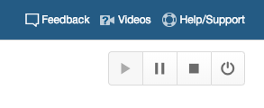
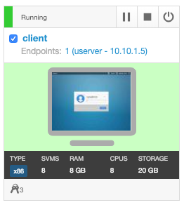
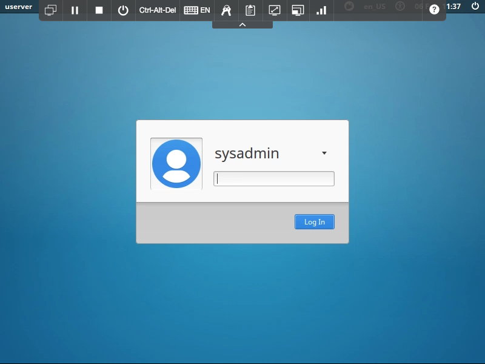
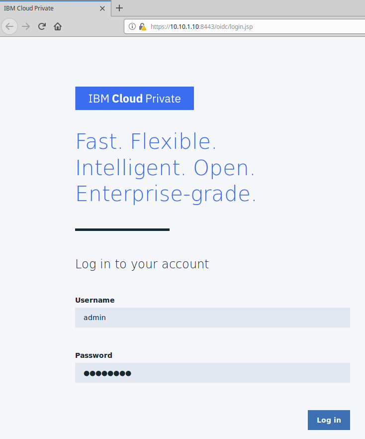
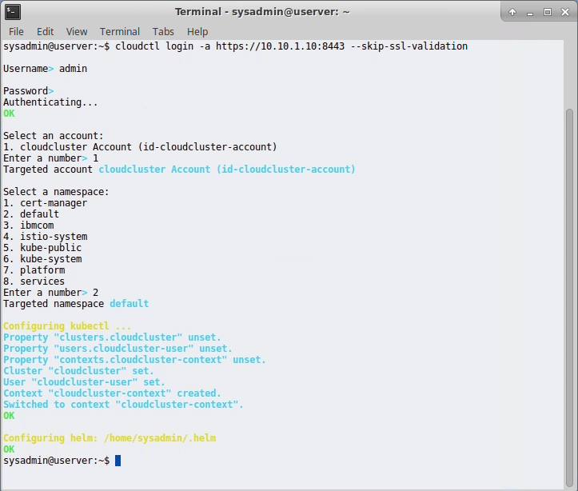

# Starting Up the Lab Environment

## Use these steps to power up your IBM Cloud Private cluster and prepare for the lab

Login to SkyTap.  Start the cluster by using the **Start** button in the upper left hand corner to start all the nodes



Once all systems show **Running** status (this may take a few minutes), open the **client** system from within the SkyTap interface



> You can adjust the screen resolution of the SkyTap environment using the  and  buttons in the menu bar.

At the prompt, login using **sysadmin** with password of **passw0rd**



After you have logged in to the system:

- Open the **Firefox Web Browser** (link on the desktop) 
- Enter the URL https://10.10.1.10:8443 in the address bar to access the ICP dashboard
- Login with the credentials userid/password = **admin/passw0rd**



Next open another Browser tab and navigate to **ibm.biz\thinkcal**

> By opening the above link you will easily be able to copy commands from the lab into your SkyTap environment.  Copying and pasting using the SkyTap environment can become tedious.

Next open the **Terminal** application (link on the desktop)

Initialize the ICP CLI userid/password = **admin/passw0rd**

```
cloudctl login -a https://10.10.1.10:8443 --skip-ssl-validation
```

Select the **cloudcluster** account and the **default** namespace when prompted.



[Next continue on to Part 1 Securing Your Cluster with NetworkPolicy](./part-1-securing-your-cluster.md)
