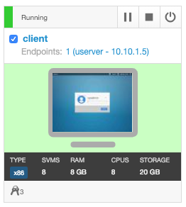
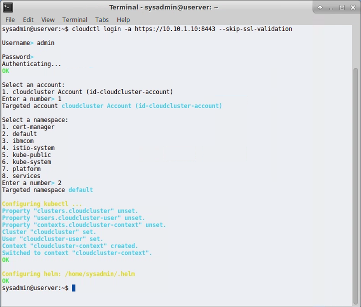

Before you begin


1. Login to Skytap and startup your environment.

   1. Click the Start button in the upper left hand corner to start all the nodes in your environment.
   2. 

2. Wait for all the systems to start.

3. Once all systems show "Running" status. Open the client system from skytap

4. 

5. **Note:** You can adjust the screen resolution of the skytap environment using the  and  buttons in the menu bar.

6. At the prompt, login using sysadmin with password of "passw0rd"

7. 

8. After you have logged in to the system. 

   1. Open the Firefox Web Browser (link on the desktop). 
   2. Enter the URL https://10.10.1.10:8443 in the address bar to access the ICP dashboard.
   3. Login with the credentials userid/password = **admin/passw0rd**
   4. 

9. Next open another Browser tab and navigate to **ibm.biz\thinklab**

10. Next open the Terminal application (link on the desktop)

11. Initialize the ICP CLI userid/password = **admin/passw0rd**

    ```
    cloudctl login -a https://10.10.1.10:8443 --skip-ssl-validation
    ```

    Select the **cloudcluster** account and the **default** namespace when prompted.

    

12. 

13. 

      